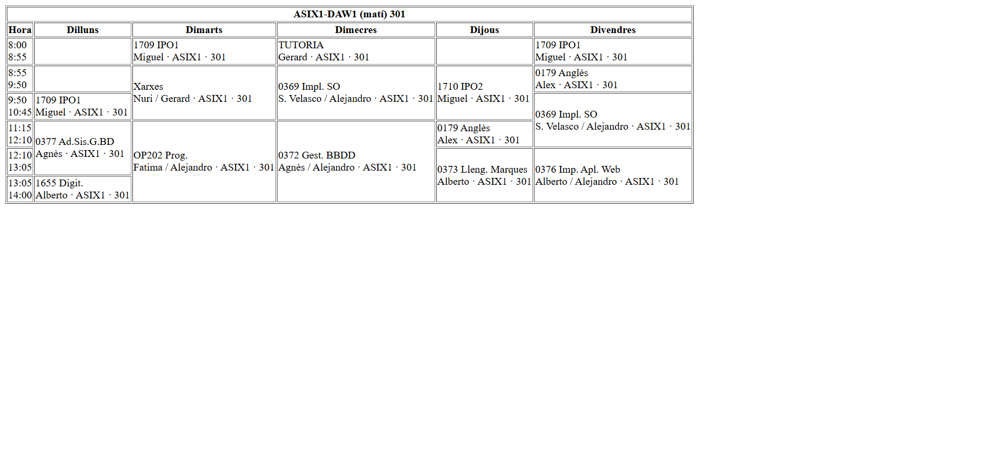
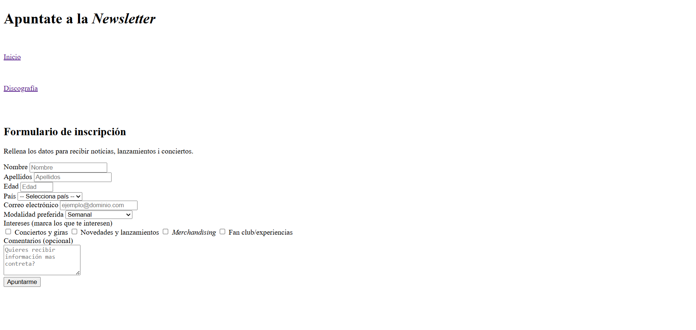
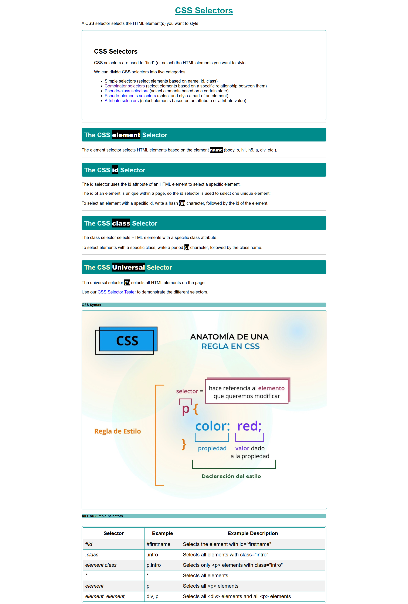

# ASIX1_0373_AE1b_Mi_Documentaci-n #
## Github y Git ##

### ¿Qué es GitHub? ###
GitHub es una plataforma online que aloja repositorios Git.
Además permite colaborar, revisar código, gestionar proyectos y compartir tu trabajo.
### Crear un repositorio en GitHub ###
1. Ve a github.com y accede a tu cuenta.
2. Haz clic en New repository.
3. Rellena:
- Nombre del repositorio
- Descripción (opcional)
- Visibilidad: público o privado
7. Opcional: inicializa con README, .gitignore, y licencia.
8. Haz clic en Create repository.
### Comenzar con Git ###
#### Inicializa Git abriendo un cmd en tu carpeta local
"git init"

#### Configura tu usuario (solo una vez)
"git config --global user.name "Tu Nombre""
"git config --global user.email "tu@email.com""

#### Añade archivos al área de preparación
"git add archivo.txt"

#### Guarda los cambios con un mensaje
"git commit -m "Primer commit""

#### Sube tu proyecto
"git push origin main"

### Comandos esenciales de Git

| Comando | Descripción | 
|-----------|----------------|
| **git init** | Inicializa un repositorio local |
| **git clone + URL** | Clona un repositorio remoto | 
| **git status** | Muestra el estado de los archivos |
| **git add .** | Añade archivos al área de preparación |
| **git commit -m "mensaje"** | Guarda los cambios con un mensaje |
| **git push** | Sube los cambios al repositorio remoto |
| **git log** | Muestra el historial de commits 1 |
| **git branch** | Lista ramas |


## HTML

### ¿Que es HTML?
HTML (HyperText Markup Language) es el lenguaje estándar para estructurar el contenido de una página web.
Se basa en etiquetas (tags) que definen los diferentes elementos de la página: títulos, párrafos, imágenes, enlaces, tablas, formularios, etc.

### Estructura básica de un documento HTML
```
<!DOCTYPE html>
<html lang="es">
<head>
  <meta charset="UTF-8">
  <meta name="viewport" content="width=device-width, initial-scale=1.0">
  <title>Título de la página</title>
</head>
<body>
  <!-- Contenido visible -->
</body>
</html>
```

### Etiquetas Fundamentales HTML
```
<!DOCTYPE html>
```
Función: Declara el tipo de documento y versión de HTML.
Ejemplo: <!DOCTYPE html> indica que es HTML5.


```
<html lang="es">
```
Función: Elemento raíz que contiene todo el documento HTML.
Ejemplo: <html lang="es"> define español como idioma.

```
<head>
```
Función: Contiene metadatos, enlaces y scripts no visibles.
Ejemplo:

```
<head>
    <meta charset="utf-8">
    <title>Mi Página</title>
</head>

<body>
```
Función: Contiene todo el contenido visible de la página.
```
Ejemplo: <body><h1>Hola Mundo</h1></body>
```

### ETIQUETAS DE TABLAS
#### Estructura de Tablas
```
<table border="1">
```
Función: Crea una tabla con borde visible.
Ejemplo:
```
 <table border="1"> tabla con bordes de 1px.
 ```

```
<thead>
```
Función: Define la sección de encabezado de la tabla.
Ejemplo:
```
<thead>
    <tr><th>Nombre</th><th>Edad</th></tr>
</thead>
```

```
<tbody>
```
Función: Define el cuerpo principal de la tabla.
Ejemplo:
```
<tbody>
    <tr><td>Juan</td><td>25</td></tr>
</tbody>
```
```
<tr>
```
Función: Define una fila en la tabla.
Ejemplo: 
```
<tr><td>Dato 1</td><td>Dato 2</td></tr>
```
```
<th>
```
Función: Define una celda de encabezado (negrita y centrada).
Ejemplo: 
```
<th>Producto</th>
```

```
<td>
```
Función: Define una celda normal de datos.
Ejemplo: 
```
<td>Manzanas</td>
```
#### Exemple portat a una activitat

### Atributos Especiales de Tablas
```
colspan="X"
```
Función: Une horizontalmente X celdas.
```
Ejemplo: <th colspan="2">Título Amplio</th>
```

```
rowspan="X"
```
Función: Une verticalmente X celdas.
Ejemplo: 
```
<td rowspan="2">Dato Largo</td>
```

### ETIQUETAS MULTIMEDIA
#### Imágenes
```

```
Función: Inserta una imagen en la página.
Ejemplo:
```

```
#### Audio
```
<audio controls>
```
Función: Reproductor de audio con controles.
Ejemplo:
```
<audio controls>
    <source src="musica/cancion.mp3" type="audio/mpeg">
</audio>
```
#### Contenido Embebido
```
<iframe>
```
Función: Inserta contenido externo en la página.
Ejemplo:
```
<iframe src="https://open.spotify.com/embed/track/..." width="100%" height="152"></iframe>
```

### ETIQUETAS DE FORMULARIO
#### Estructura del Formulario
```
<form action="url" method="post">
```
Función: Define un formulario para entrada de datos.
Ejemplo:
```
<form action="procesar.php" method="post" enctype="multipart/form-data">
```
#### Campos de Entrada
```
<input type="text">
```
Función: Campo de texto de una línea.
Ejemplo:
```
<input type="text" name="nombre" placeholder="Tu nombre" required>
```

```
<input type="email">
```
Función: Campo específico para emails con validación.
Ejemplo: 
```
<input type="email" name="email" required>
```
```
<input type="number">
```
Función: Campo para números con controles.
Ejemplo:
```
<input type="number" name="edad" min="0" max="100">
```
```
<input type="checkbox">
```
Función: Casilla de verificación múltiple.
Ejemplo:
```
<input type="checkbox" name="intereses" value="musica"> Música
```
### Exemple portat a una activitat

#### Listas Desplegables
```
<select>
```
Función: Lista desplegable de opciones.
Ejemplo:
```
<select name="pais">
    <option value="es">España</option>
    <option value="mx">México</option>
</select>
```
```
<textarea>
```
Función: Campo de texto multilínea.
Ejemplo:
```
<textarea name="comentario" rows="4" cols="50"></textarea>
```
```
<button type="submit">
```
Función: Botón para enviar el formulario.
Ejemplo: 
```
<button type="submit">Enviar</button>
```

### ETIQUETAS DE CONTENIDO
#### Encabezados
```
<h1> a <h6>
```
Función: Define encabezados de diferentes niveles.
Ejemplo:
```
<h1>Título Principal</h1>
<h2>Subtítulo</h2>
<h3>Apartado</h3>
```
#### Párrafos y Saltos
```
<p>
```
Función: Define un párrafo de texto.
Ejemplo:
```
<p>Este es un párrafo de ejemplo.</p>
```
```
<br>
```
Función: Salto de línea (etiqueta vacía).
Ejemplo: 
```
Texto aquí<br>Nueva línea
```
#### Enlaces
```
<a href="url">
```
Función: Crea un hipervínculo.
Ejemplo:
```
<a href="pagina2.html">Ir a página 2</a>
<a href="#seccion">Ir a sección</a>
```
#### Listas
```
<ol>
```
Función: Lista ordenada (numerada).
Ejemplo:
```
<ol>
    <li>Primer paso</li>
    <li>Segundo paso</li>
</ol>
```
```
<ul>
```
Función: Lista no ordenada (con viñetas).
Ejemplo:
```
<ul>
    <li>Elemento 1</li>
    <li>Elemento 2</li>
</ul>
```
```
<li>
```
Función: Elemento individual de una lista.
Ejemplo: 
```
<li>Manzanas</li>
```

### ETIQUETAS DE FORMATEO
#### Texto
```
<strong>
```
Función: Texto en **negrita** (importancia semántica).
Ejemplo: 
```
<strong>Texto importante</strong>
```
```
<em> o <i>
```
Función: Texto en *cursiva* (énfasis).
Ejemplo: 
```
<i>Texto en cursiva</i>
```
```
<hr>
```
Función: Línea horizontal separadora.
Ejemplo: <hr> crea una línea divisoria.

### ETIQUETAS META Y ENLACES
#### Metadatos
```
<meta charset="utf-8">
```
Función: Define la codificación de caracteres.
Ejemplo: Obligatorio para caracteres especiales.
```
<meta name="viewport" content="width=device-width, initial-scale=1">
```
Función: Configura la visualización en dispositivos móviles.
Ejemplo: Esencial para diseño responsive.

#### Enlaces Externos
```
<link rel="icon" href="ruta">
```
Función: Define el favicon de la página.
Ejemplo: 
```
<link rel="icon" href="favicon.ico">
```

```
<script src="url"></script>
```
Función: Enlaza o ejecuta código JavaScript.
Ejemplo:
```
<script src="https://kit.fontawesome.com/..."></script>
```
### VALIDATOR HTML
#### ¿Qué es el Validator HTML?
Es una herramienta oficial del W3C que verifica si el código HTML cumple con los estándares web.

#### ¿Para qué sirve?
- Detecta errores de sintaxis

- Verifica etiquetas mal cerradas

- Comprueba atributos incorrectos

- Asegura compatibilidad entre navegadores

#### Cómo usarlo:
1. Visitar validator.w3.org

2. Introducir URL, subir archivo o pegar código

3. Revisar los errores y advertencias

4. Corregir problemas identificados


#### Cómo se ve el validador


## SELECTORES CSS Y ESPECIFICIDAD
Los selectores definen sobre qué elementos HTML se aplicarán los estilos. No todos tienen la misma fuerza o "peso".

### 1. Tipos de Selectores
* **Universal (`*`)**: Selecciona todo en el documento.
* **De Etiqueta (`h1`, `div`)**: Afecta a todos los elementos de ese tipo.
* **De Clase (`.clase`)**: Selecciona elementos con el atributo class. Reutilizable.
* **De ID (`#id`)**: Selecciona un único elemento. Muy alta prioridad.

### 2. Combinadores
* **Hijo Directo (`>`)**: `li > a` (solo enlaces que son hijos inmediatos de un li).
* **Descendiente (espacio)**: `#gallery div` (todos los div dentro de #gallery, sin importar nivel).
* **Múltiple (`,`)**: `h1, .titulo` (aplica el mismo estilo a ambos).

### 3. Especificidad (Jerarquía)
Si dos reglas chocan, el navegador elige la más específica siguiendo este orden de peso:
1.  **Estilos en línea** (`style="..."`).
2.  **ID** (`#nombre`).
3.  **Clases, Pseudoclases y Atributos** (`.clase`, `:hover`).
4.  **Elementos y Pseudoelementos** (`p`, `::before`).


---

## MAQUETACIÓN: FLEXBOX Y OVERFLOW
La maquetación controla cómo se distribuyen los elementos y qué ocurre cuando el contenido excede su tamaño.

### 1. Desbordamiento (Overflow)
Controla el contenido que se sale de los límites de una caja:
* `overflow: visible`: El contenido se sale y se ve (por defecto).
* `overflow: hidden`: Lo que sobra se corta y desaparece.
* `overflow: scroll`: Añade barras de navegación siempre.
* `overflow: auto`: Añade barras solo si el contenido no cabe.
* **Text Overflow**: Para textos largos que no caben, usamos `text-overflow: ellipsis` junto con `white-space: nowrap` para crear los famosos puntos suspensivos (...).

### 2. Flexbox (`display: flex`)
Es un modelo de caja que permite alinear elementos fácilmente.
* **Contenedor**: Se usa `justify-content` (eje horizontal) y `align-items` (eje vertical).
* **Flex Wrap**: `flex-wrap: wrap` es esencial; si los elementos no caben en una línea, saltan a la siguiente.

---

## POSICIONAMIENTO (`position`)
Controla cómo se colocan los elementos fuera del flujo normal.

| Propiedad | Uso Principal |
| :--- | :--- |
| **`static`** | El valor por defecto. Sigue el orden del HTML. |
| **`relative`** | Se mueve sin afectar a los demás. Sirve de referencia para hijos absolutos. |
| **`absolute`** | Se coloca respecto al padre relativo más cercano. "Flota" sobre el diseño. |
| **`fixed`** | Se queda pegado a la pantalla (Viewport). No le afecta el scroll. |
| **`sticky`** | Se queda pegado al techo cuando llegas a él haciendo scroll, pero no sale de su padre. |

---

## DISEÑO RESPONSIVE (MEDIA QUERIES)
El diseño responsive permite que una web se vea bien tanto en un monitor de PC como en un móvil. Se basa en detectar el ancho de la pantalla y aplicar reglas diferentes.

### 1. Puntos de Interrupción (Breakpoints)
* **Escritorio (Desktop)**: Se define por defecto (ej: 4 columnas al 25%).
* **Tablet (max-width: 900px)**: Se ajusta a 2 columnas (50%).
* **Móvil (max-width: 600px)**: Se ajusta a 1 columna (100%).

### 2. Ejemplo de código Responsive
```css
/* Configuración por defecto (Pantallas grandes) */
.card-container {
    width: 25%;
    display: flex;
}

/* Ajuste para tablets (iPad Mini) */
@media (max-width: 900px) {
    .card-container {
        width: 50%; /* Ahora caben dos por fila */
    }
}

/* Ajuste para móviles (iPhone) */
@media (max-width: 600px) {
    .card-container {
        width: 100%; /* Una tarjeta por fila */
    }
}
